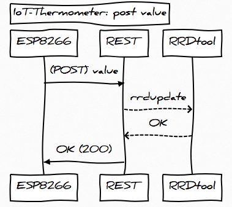
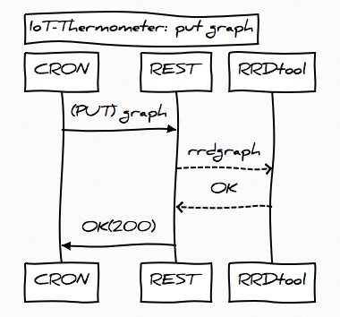

# IoT Thermometer

## ..ernsthaft?

Ich war auf der Suche nach einem Hobbyprojekt, bei dem ich einige, für mich neue Dinge ausprobieren konnte und bestenfalls dabei am Ende etwas herauskommt, was einen zusätzlichen Nutzen hat.

Bei der Arbeit auf der Terasse kam mir der Gedanke, ob ich nicht ein Thermometer dort aufstellen könnte und jederzeit per Handy die dortigen Werte (Temperatur und Luftfeuchtigkeit) abrufen könne, um z.B. zu entscheiden, dass ich besser im Wohnzimmer bleibe.

(Ok, man könnte auch einfach herausgehen, aber ...) 

Mir ist völlig klar, dass es bereits unzählige dieser oder ähnlicher Projekte gibt (was ja auch ein Vorteil ist, da ich dann ja irgendwo nachschauen kann).

## Wunschliste

Bei folgenden Themen möchte ich mein Wissen / Erfahrungen aufbessern bzw. vertiefen:

- Softwarethemen
  - [PHP 7.*](https://www.heise.de/developer/artikel/PHP-7-Skriptsprache-kommt-in-der-Gegenwart-an-3015929.html?seite=all)
  - [REST](https://de.wikipedia.org/wiki/Representational_State_Transfer)
  - [RRDtool](https://oss.oetiker.ch/rrdtool/)
  - [GitHub Pages](https://pages.github.com/)
  - [Markdown](https://de.wikipedia.org/wiki/Markdown)
- Hardwarethemen
  - Mikrokontroller anhand des [ESP8266](https://de.wikipedia.org/wiki/ESP8266) (genauer: [NodeMCU Lua Amica Module V2 ESP8266 ESP-12E WIFI](https://www.amazon.de/AZDelivery-NodeMCU-ESP8266-ESP-12E-Development/dp/B06Y1LZLLY?th=1))
    - Sensor DHT22 [Amazon](https://www.amazon.de/gp/product/B01DB8JH4M/ref=oh_aui_search_detailpage?ie=UTF8&psc=1)
  - [Raspberry PI Zero W](https://de.wikipedia.org/wiki/Raspberry_Pi)

## "Projektplan"

Zuerst habe ich für einige Dinge per Prototyping die Machbarkeit geprüft.

Nun muss ich mir eine sinvolle Ordnerstruktur überlegen.

# Use-Cases

Nagt, es sind keine Use-Cases in strengen UML-Sinne, aber es beschreibt, wie die KOmponenten zusammenarbeiten sollen.

## Temperatur[^1] loggen

Alle 60 Sekunden ermittelt der ESP8226 mithilfe des DHT22 die aktuelle Temperatur und sendet diese dann per HTTP-POST an den REST-Service. Dort wird der Wert dann in der RRD gespeichert.

## letzte Temperatur anzeigen

Wenn die entsprechende Webseite aufgerufen wird, wird mittels [JavaScript Fetch](https://developer.mozilla.org/en-US/docs/Web/API/Fetch_API/Using_Fetch) ein asynchroner Request abgesetzt, welcher ein Json zurückbekommt. So aktualisiert sich die Webseite neu, wobei nur das kleine Json neu abgerufen werden muss. 

 

## Grafiken erstellen

Per crnjob (z.B. alle 5 Minuten) wird die Generierung der Verlaufsgrafik angestoßen

[^1]: Wenn ich von Temperatur rede, gilt dies üblicherweise ebenso auch für die Luftfeuchtigkeit, welcher der Sensor ebenfalls ermittelt