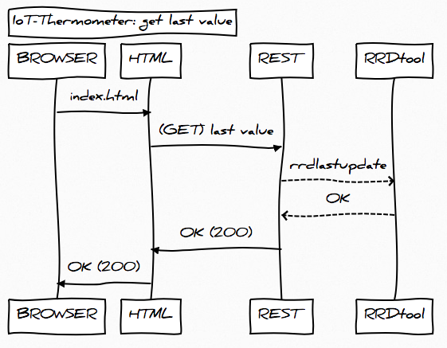

# post value


```
Title: IoT-Thermometer: post value
ESP8266->REST: (POST) value
REST-->>RRDtool: rrdupdate
RRDtool-->>REST: OK
REST->ESP8266: OK (200)
```

# get last value



```
Title: IoT-Thermometer: get last value
BROWSER->HTML: index.html
HTML->REST: (GET) last value
REST-->>RRDtool: rrdlastupdate
RRDtool-->>REST: OK
REST->HTML: OK (200)
HTML->BROWSER: OK (200)
```

# put graph


```
Title: IoT-Thermometer: put graph
CRON->REST: (PUT) graph
REST-->>RRDtool: rrdgraph
RRDtool-->>REST: OK
REST->CRON: OK(200)
```


[Tool](https://bramp.github.io/js-sequence-diagrams/)

